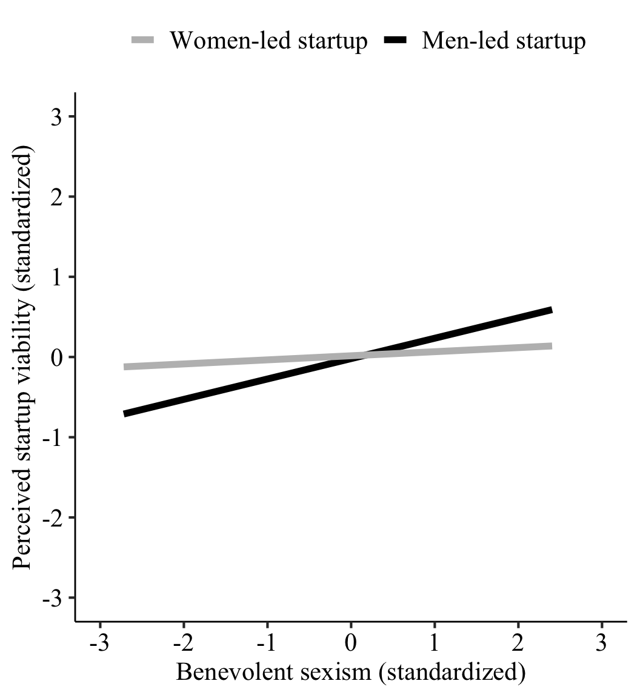

# Benevolent Sexism and the Gender Gap in Startup Evaluation

Welcome to our project repository!

Hello and thanks for dropping by! We're excited to share our journey into the startup world, where we examined how seemingly positive attitudes towards women, known as benevolent sexism, influence how startups are evaluated. Our research has garnered attention in both academic circles, being published in ["Entrepreneurship: Theory and Practice"](https://journals.sagepub.com/doi/10.1177/10422587231178865), and the wider public, featured in ["The Conversation Canada"](https://theconversation.com/benevolent-sexism-in-startups-widens-the-gender-gap-by-advantaging-men-over-women-222486). We invite you to dive into our findings and explore the surprising ways subtle and often overlooked forces influence the startup ecosystem.

## Our approach

At the heart of our investigation are three survey experiments with over 1000 participants across Canada, the US, and the UK. These participants, who brought different levels of startup evaluation experiences, were randomly assigned to assess a startup helmed by either a men or a women founder. To ensure our comparison was as fair as possible, we kept the startup idea and founder qualifications consistent across the board. The only difference is the founder's gender. After their evaluations, we also measured each participant's level of benevolent sexism. This allowed us to untangle the complex interplay between these subtle sexist attitudes and how they affect the perceived viability of startups.

## What we discovered

Our initial assumptions were turned on their head. Instead of diminishing the evaluations of women-led startups, benevolent sexism actually seemed to boost the appeal of startups led by men, leaving the assessment of women's ventures unchanged. This revelation opens up a new perspective on gender bias within the startup world, showing that sexism isn't solely about direct negativity towards women. It also encompasses seemingly positive, yet patronizing attitudes portraying women as wonderful yet fragile creatures in need of protection. Moreover, inequity is not just about unfair barriers against women, it is also about unearned advantages for men while women receive the standard treatment.  

*Graph illustrating the differential impact of benevolent sexism on startup evaluation based on the founder's gender (from Study 1). The more evaluators endorse benevolent sexism, the more viable they perceive men-led startups, whereas benevolent sexism is unrelated to perceptions of women-led startups' viability*

## Inside this repository

- Descriptive Statistics Analysis (`Descriptive_statistics.qmd`/`.html`): A primer on the foundational descriptive statistics.
- Regression Analyses (`Regression_analyses.qmd`/`.html`): A deep dive into regression analyses, including hierarchical moderated regression, simple slope analysis, and moderated mediation analysis.
    
To fully engage with our findings, please open the `.html` files in a web browser.

## Data Availability and Ethical Considerations

We prioritize openness while respecting our participants' privacy; thus, the raw data from our study is not publicly available due to the lack of consent for open data sharing. Nevertheless, we are open to individual requests for data access, which can be directed to the first author.

## Citing our work

Should our research spark inspiration or contributes to your work, please cite our study:

Nguyen, N., Hideg, I., Engel, Y., & Godart, F. (2023). Benevolent Sexism and the Gender Gap in Startup Evaluation. Entrepreneurship Theory and Practice. https://doi.org/10.1177/10422587231178865

